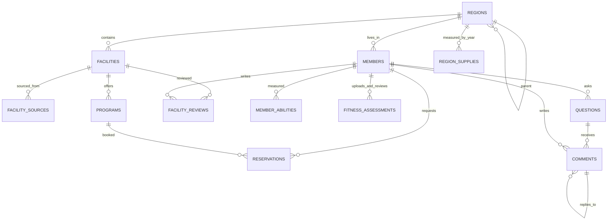

# 수정 ERD

`EXERCISE_RECOMMENDATIONS`는 연령 범위 기준의 독립 공공데이터입니다. 회원별 운동 추천은 회원의 나이와 측정 점수를 서비스에서 조합해 계산하며, 원천 자료를 회원 테이블에 복사하지 않습니다.

`FITNESS_ASSESSMENTS`는 국민체력100 PDF에서 확인한 검사일 당시 나이, 연령 구분, A~D 참고 등급, 참고 점수와 측정값 JSON의 이력입니다. 원본 PDF는 저장하지 않습니다. 기존 `MEMBER_ABILITIES`는 초기에 만든 요약 점수 모델이며 이번 PDF 결과는 독립 평가 이력으로 저장합니다.

`FACILITY_SOURCES`의 `(dataset_code, source_key)`는 같은 원천 레코드의 재수집을 막습니다. 서로 다른 데이터셋에 같은 시설이 들어 있는지는 별도의 명칭·주소 정규화와 검수로 판단해야 합니다.

공공 프로그램의 `programs.source_key`는 동일 원천 강좌의 재수집 식별자입니다. `begins_on`, `ends_on`, `registration_url`은 파일의 운영 기간·기관 홈페이지를 저장합니다. `capacity`는 모집 정원이며 실시간 남은 좌석이 아닙니다. 공공 프로그램에 대한 `reservations.status=REQUESTED`는 앱 내부 신청 기록이고 기관의 예약 확정이 아닙니다.
